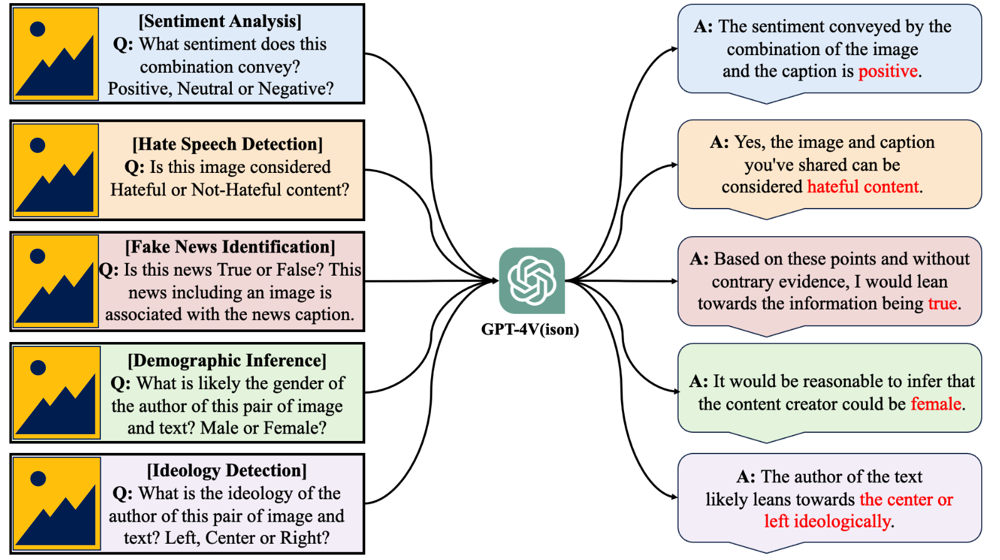

<!-- <div align=center>

</div> -->
<h2 align="center"> <a href="https://arxiv.org/abs/2311.07547">GPT-4V(ision) as A Social Media Analysis Engine</a></h2>
<h5 align="center"> If you like our project, please give us a star ⭐ on GitHub for the latest update.</h5>

## 📣 News
* **[2024/12/20]** We have released our code, prompt, and data. 
* **[2024/11/21]** Our paper was accepted by the ACM Transactions on Intelligent Systems and Technology!
* **[2023/11/15]**  We will release all the eval code, prompt, and data asap! Welcome to 👀 this repository for the latest updates, stay tuned ✨!

## 📊 Data Schema
Fields: tid, text, gt
* ground truth (gt)
  * sentiment_analysis: {1: positive, 2: negative, 0: neutral}
  * hate_speech_detection: {1: hate, 0: non-hate}
  * fake_news_identification: {1: fake, 0: real}
  * demographic_inference: {1: male, 0: female}
  * ideology_detection: {1: left, 2: right, 0: center}  


## 😮 Highlights


In this paper, we explore GPT-4V(ision)'s capabilities for social multimedia analysis. We select five representative tasks, including **sentiment analysis**, **hate speech detection**, **fake news identification**, **demographic inference**, and **political ideology detection**.

<div align=center>

</div>

### 🔥 Emerging Properties of the GPT-4V as a Social Multimedia Analysis Engine

<p align="center">
  
</p>


<p align="center">
  
</p>

<p align="center">
  
</p>

<p align="center">
  
</p>

<p align="center">
  
</p>

<p align="center">
  
</p>

### 📈 The Challenges and Opportunities of Social MultiMedia with GPT-4V
<p align="center">
  
</p>

<p align="center">
  
</p>

<p align="center">
  
</p>


## ✏️ Citation
If you find this paper useful, please consider staring 🌟 this repo and citing 📑 our paper:
```
@article{10.1145/3709005,
author = {Lyu, Hanjia and Huang, Jinfa and Zhang, Daoan and Yu, Yongsheng and Mou, Xinyi and Pan, Jinsheng and Yang, Zhengyuan and Wei, Zhongyu and Luo, Jiebo},
title = {GPT-4V(ision) as A Social Media Analysis Engine},
year = {2024},
publisher = {Association for Computing Machinery},
address = {New York, NY, USA},
issn = {2157-6904},
url = {https://doi.org/10.1145/3709005},
doi = {10.1145/3709005},
abstract = {Recent research has shed light on the capabilities of Large Multimodal Models (LMMs) across various general vision and language tasks. The performance of LMMs in specialized domains, such as social media, which integrates text, images, videos, and sometimes audio, remains an area of active interest. Effective analysis of such content requires models to interpret the complex interactions between different communication modalities and their influence on the conveyed message. This paper explores GPT-4V(ision)’s performance in social multimedia analysis. We evaluate GPT-4V across five representative tasks: sentiment analysis, hate speech detection, fake news identification, demographic inference, and political ideology detection. Our approach includes a preliminary quantitative analysis for each task using existing benchmark datasets, followed by a review of the results and a selection of qualitative samples to demonstrate GPT-4V’s performance in multimodal social media content analysis. GPT-4V shows effectiveness in these tasks, exhibiting capabilities like joint image-text understanding, contextual and cultural awareness, and commonsense knowledge application. However, challenges persist, including struggles with multilingual social multimedia comprehension and difficulty in adapting to the latest social media trends. It also sometimes generates incorrect information about evolving knowledge of celebrities and politicians. This preliminary study aims to inform further research across disciplines, particularly in computational social science and social media studies. The findings highlight the potential of LMMs to enhance our understanding of social media content and its users through multimodal analysis. All images and prompts used in this study will be available at .Disclaimer: This paper contains some examples of offensive social media content. Reader discretion is advised.},
note = {Just Accepted},
journal = {ACM Trans. Intell. Syst. Technol.},
month = dec,
keywords = {Large Multimodal Model, GPT-4V(ision), Social Media Analytics}
}
```
