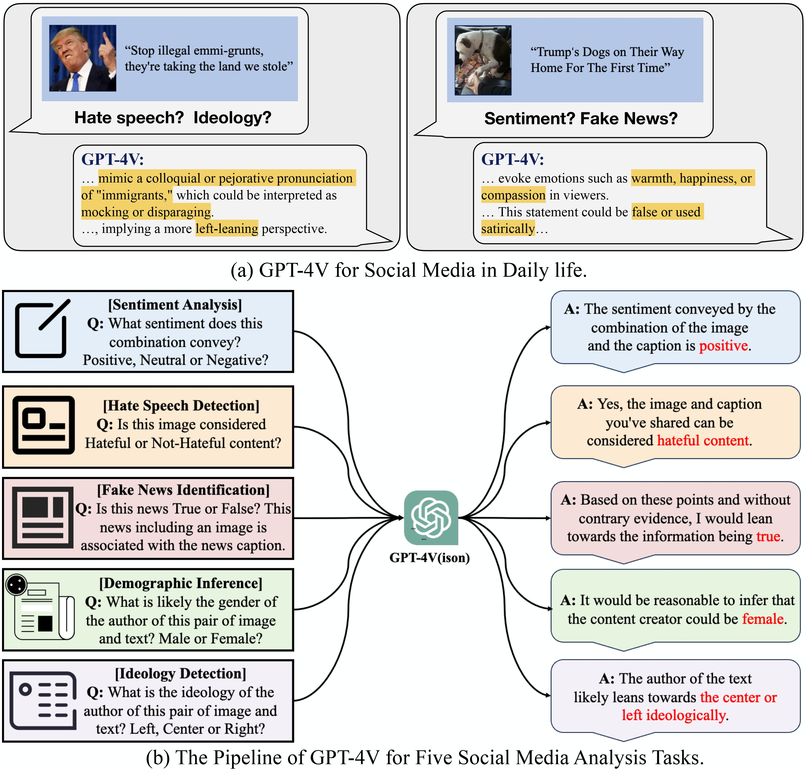

<div align=center>

</div>
<h2 align="center"> <a href="https://arxiv.org/abs/2311.07547">GPT-4V(ision) as A Social Media Analysis Engine</a></h2>
<h5 align="center"> If you like our project, please give us a star ⭐ on GitHub for the latest update.</h5>

## 📣 News
* **[2023/11/15]**  We will release all the eval code, prompt, and data asap! Welcome to 👀 this repository for the latest updates, stay tuned ✨!

## 😮 Highlights

### 💡 The First Report of the GPT-4V for Social Multimedia Analysis
In this paper, we explore GPT-4V(ision)'s capabilities for social multimedia analysis. We select five representative tasks, including **sentiment analysis**, **hate speech detection**, **fake news identification**, **demographic inference**, and **political ideology detection**.

<div align=center>

</div>

### 🔥 Emerging Properties of the GPT-4V as a Social Multimedia Analysis Engine

<p align="center">
  
</p>


<p align="center">
  
</p>

<p align="center">
  
</p>

<p align="center">
  
</p>

<p align="center">
  
</p>

<p align="center">
  
</p>

### 📈 The Challenges and Opportunities of Social MultiMedia with GPT-4V
<p align="center">
  
</p>

<p align="center">
  
</p>

<p align="center">
  
</p>


## 👍 Acknowledgement
* [The Dawn of LMMs: Preliminary Explorations with GPT-4V(ision)](https://arxiv.org/abs/2309.17421) The report motivate us a lot and it is an general comprehensive vision task analysis report of GPT-4V.
* [MM-Vid](https://multimodal-vid.github.io/) Great job contributing the video understanding of GPT-4V.


## ✏️ Citation
If you find this paper useful, please consider staring 🌟 this repo and citing 📑 our paper:
```
@article{lyu2023GPT4VSocial,
title = {GPT-4V(ision) as A Social Media Analysis Engine},
author = {Hanjia Lyu and Jinfa Huang and Daoan Zhang and Yongsheng Yu and Xinyi Mou and Jinsheng Pan and Zhengyuan Yang and Zhongyu Wei and Jiebo Luo},
journal={arXiv preprint arXiv:2311.07547},
year={2023}
}
```
